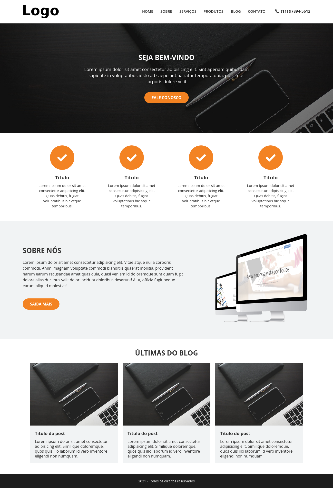

# Processo Seletivo da Ello Design

## Bem-vindo! 👋

Esse é um desafio proposto pela Empresa [Ello Design](https://www.ellosdesign.com.br/) que eu amei participar, este design foi montado para testar as habilidades dos candidatos para o processo seletivo da vaga de Estágio Programador - Front End.

## Technologies Used 🧩

* HTML5
* CSS3
* Media-queries
* Flex-box
* CSS Grid Layout
* Responsive Website

## Access My Resolution 💻

   I hosted this challenge with the help of GitHub Pages, to access my resolution of this challenge [Click Here](https://samueloliveiraa.github.io/processo-seletivo-ello-design/)
